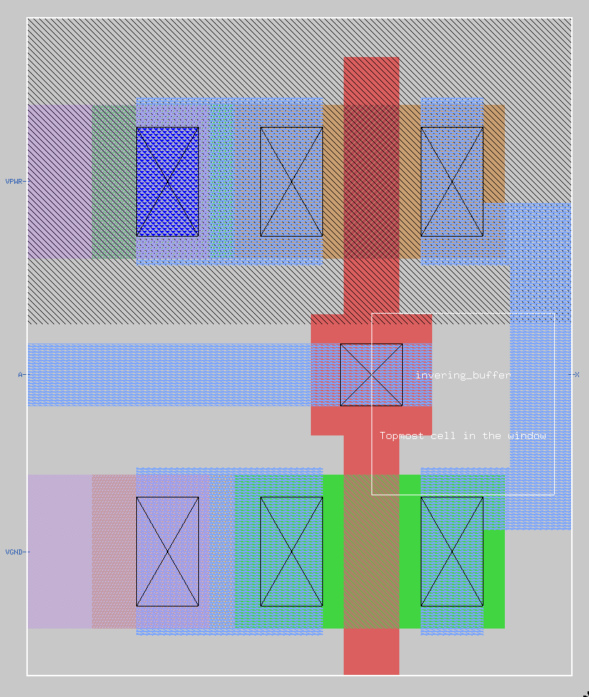
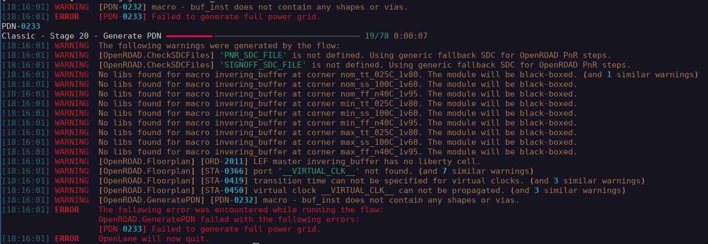

# Attempt at including small prehardened macro in Openlane2

We have created an inverter in magic and attempted to include is as a macro in the Openlane2 flow. This is meant as a first step before attempting to use bigger macros (e.g. OpenRam).

## The setup

The mag, lef, gds and vh files for the inverter are located in src/invering_buffer (creative spelling...). They are included by the inverter_top.v file in src. The inverter:

Some of the power routing issues have been fixed (like increasing die area), but other settings in config.json have been set in a desperate attempt to fix the issue.

Currently we manage to get the following error message:

In a previous attempt (where the run files have unfortunatelly been lost) we managed to get the signals routed to the inverter (but not to the points specified by our ports), however, there was no power routed to the macro. 